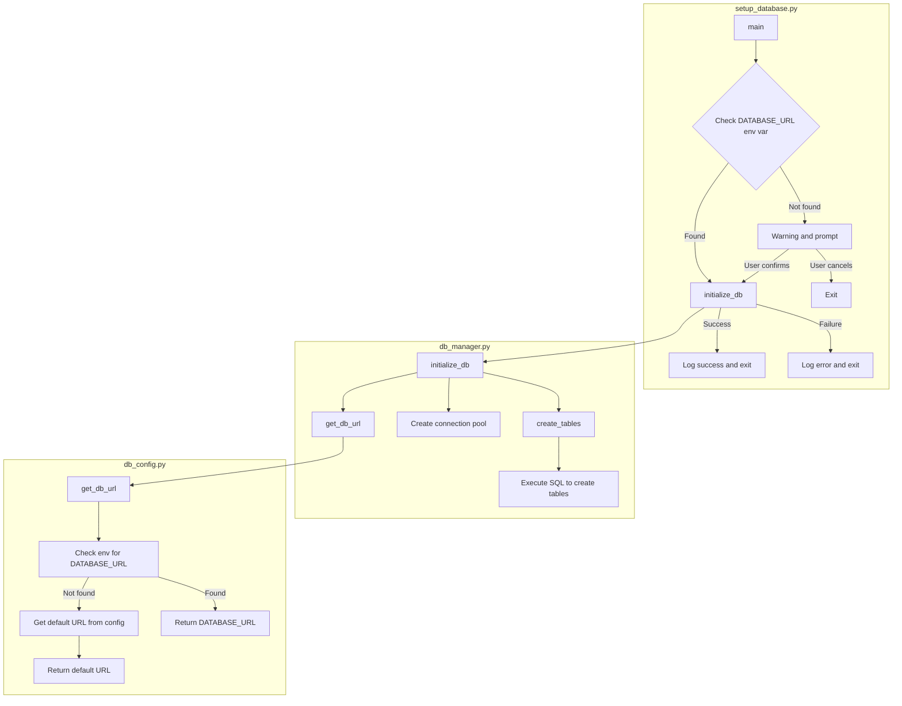
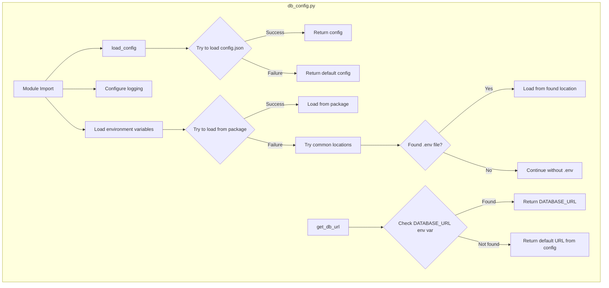
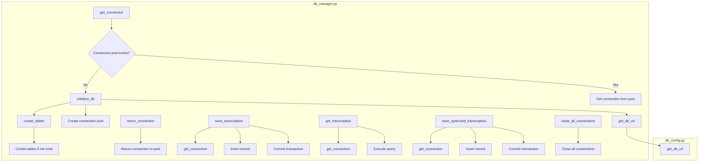
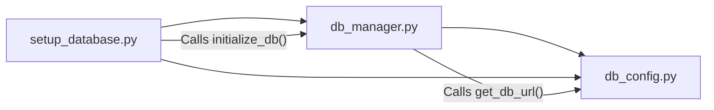

# Voice Diary Database Module Diagrams

This document visualizes the relationships and flow between the database modules in the Voice Diary application.

## Setup Database Module Flow

## Database Configuration Module Flow

## Database Manager Module Flow

## Overall Module Relationships

